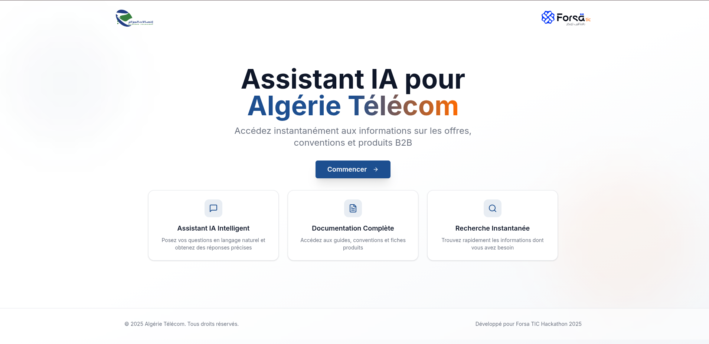
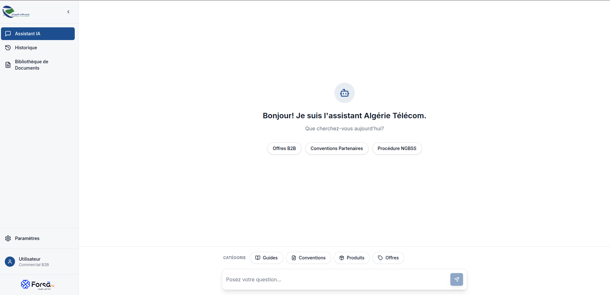
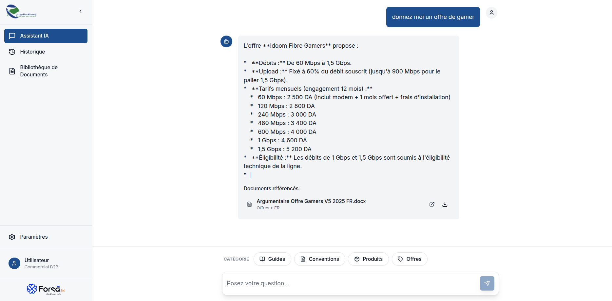
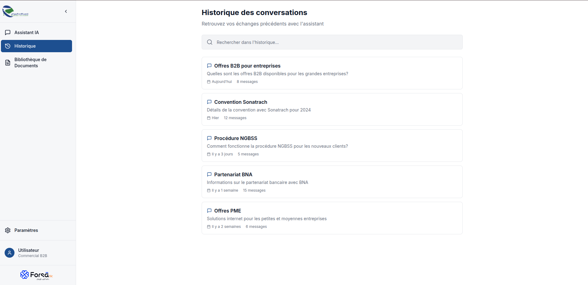
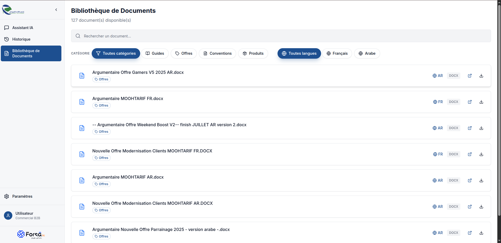

# Forsa samrt chat bot 

This is a chatbot application for Algeria Telecom that provides assistance with telecom-related queries using a document-based knowledge system. It was developed during the **Forsa hackathon organized by Algeria Telecom.**

## Features

- Interactive chat interface for user queries
- Document library with categorized telecom guides, conventions, offers, and products
- Search dashboard for document discovery
- History tracking for conversations
- Multi-language support (Arabic and French)

## Screenshots

### Landing Page

### Chat Interface

### chat history

### Document Library

## Architecture

The project consists of three main components:

- **chat-bot-algerie-telecom**: Python-based chatbot backend with processing pipelines
- **forsa-endpoints**: Document storage and API endpoints using S3
- **forsa-frontend**: React-based web interface

## Installation

1. Ensure Docker and Docker Compose are installed
2. Clone the repository
3. Copy `.env.example` to `.env` and configure environment variables
4. Run `docker-compose up` to start all services

## Usage

Access the web interface at `http://localhost:3000` after starting the services. The chatbot can answer questions about Algeria Telecom services, guides, and offers based on the indexed documents.

## Development

- Frontend: `cd forsa-frontend && npm install && npm run dev`
- Backend: Refer to individual service READMEs for setup

## License

© 2025 Algérie Télécom. Tous droits réservés.

Développé pour Forsa TIC Hackathon 2025