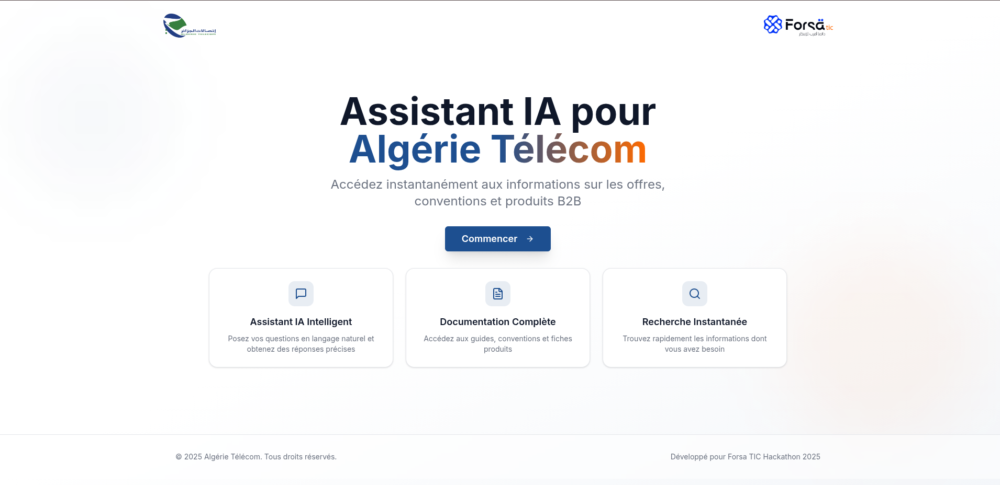
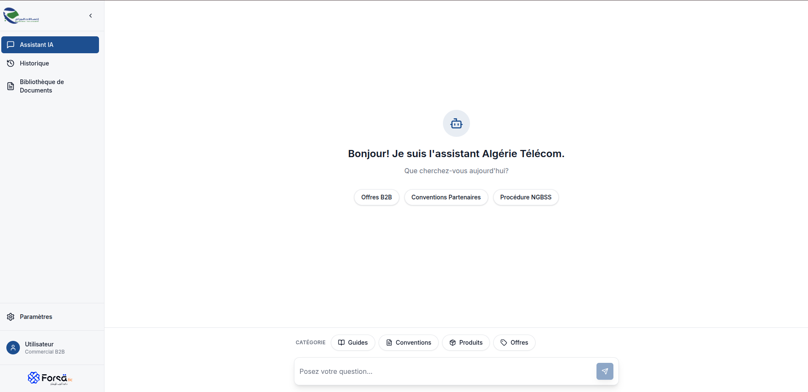
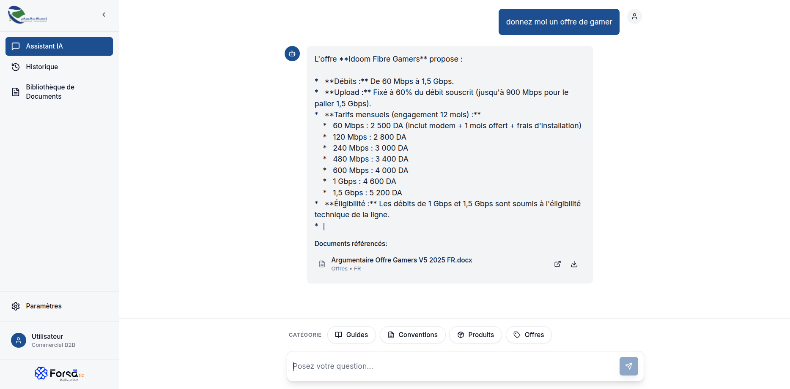
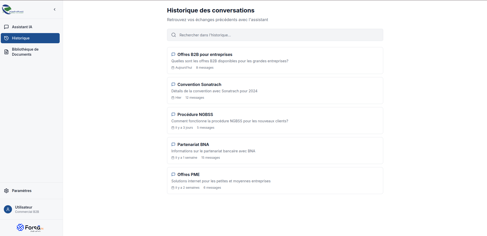
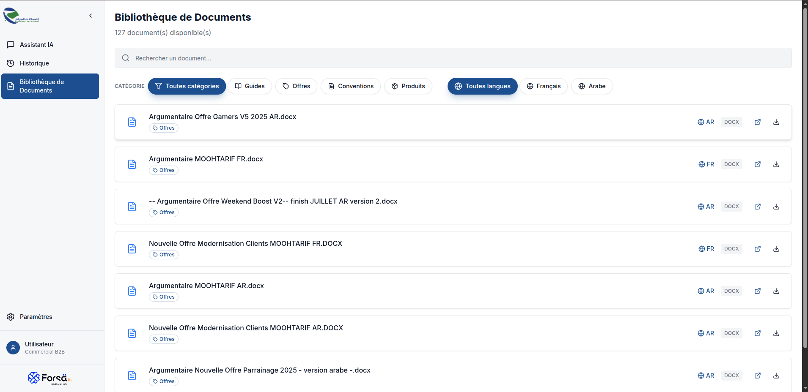

# Forsa Smart Chatbot

An intelligent chatbot system for Algérie Télécom, powered by **local AI** (Qwen 2.5 3B) and an advanced **Graph-Augmented RAG** pipeline for citation-faithful, hallucination-resistant responses on internal documents.

## Overview

This chatbot provides instant answers about:
- **Guides** - Internal procedures and processes
- **Conventions** - Partnership agreements
- **Produits** - Products and equipment
- **Offres** - Commercial offers and pricing

## Screenshots

### Landing Page


### Chat Interface



### Chat History


### Document Library


## Architecture

### System Services

```
┌─────────────────────────────────────────────────────────┐
│                    Docker Services                      │
│  ┌──────────┐  ┌──────────────┐  ┌─────────────────┐  │
│  │  MinIO   │  │ Retrieval    │  │   Frontend      │  │
│  │  S3      │  │ API          │  │   React + Vite  │  │
│  │  :9010   │  │ :8000        │  │   :5173         │  │
│  └──────────┘  └──────────────┘  └─────────────────┘  │
└─────────────────────────────────────────────────────────┘
                         ↕
┌─────────────────────────────────────────────────────────┐
│              Host Machine (with GPU)                    │
│  ┌───────────────────────────────────────────────────┐  │
│  │  Chatbot API (FastAPI + Qwen 2.5 3B)   :8001      │  │
│  │  • Graph-Augmented RAG (KG + Vector)              │  │
│  │  • Argument Mining (FR legal text)                │  │
│  │  • Citation-Faithful Generation                   │  │
│  │  • Hallucination Validation                       │  │
│  └───────────────────────────────────────────────────┘  │
└─────────────────────────────────────────────────────────┘
```

### Advanced RAG Pipeline

```
Raw Documents (PDF / JSON)
        │
        ▼
┌──────────────────────┐
│  DocumentStructure   │  ← pages, articles, clauses with coordinates
│       Parser         │
└──────────┬───────────┘
           │
  ┌────────┴────────┐
  ▼                 ▼
┌────────────┐  ┌──────────────────────┐
│  Argument  │  │  Entity / Relation   │
│   Miner    │  │     Extractor        │
│ (FR legal) │  │ (orgs, products,     │
│            │  │  legal refs)         │
└─────┬──────┘  └──────────┬───────────┘
      │                    │
      └──────────┬──────────┘
                 ▼
      ┌─────────────────────┐
      │   Knowledge Graph   │  ← NetworkX DiGraph (nodes.json + graph.pkl)
      │   + Vector Index    │
      └──────────┬──────────┘
                 ▼
      ┌─────────────────────┐
      │  Graph-Augmented    │  ← BM25/dense first, then 2-hop KG expansion
      │    Retriever        │
      └──────────┬──────────┘
                 ▼
      ┌─────────────────────┐
      │  Citation-Faithful  │  ← structured prompt → LLM → regex validator
      │    Generator        │
      └──────────┬──────────┘
                 ▼
      ┌─────────────────────┐
      │   Hallucination     │  ← cross-checks every claim vs KG nodes
      │    Validator        │     returns faithfulness score 0.0–1.0
      └─────────────────────┘
```

## Quick Start

### Prerequisites

- **Docker & Docker Compose**
- **NVIDIA GPU** with CUDA support (6 GB+ VRAM recommended)
- **Conda** with a `fyp` environment (Python 3.11)
- **Node.js** (for frontend development outside Docker)

### 1. Clone the Repository

```bash
git clone https://github.com/sohaib162/forsa-smart-chatbot
cd forsa-smart-chatbot
```

### 2. Start Docker Services

```bash
# Start MinIO, Retrieval API, and Frontend
docker compose up -d

# Verify all containers are running
docker compose ps
```

This starts:
| Service | URL |
|---|---|
| MinIO (object storage) | http://localhost:9010 |
| MinIO Console | http://localhost:9011 (minioadmin / minioadmin) |
| Retrieval API | http://localhost:8000 |
| Frontend | http://localhost:5173 |

### 3. Start the Chatbot API (GPU)

```bash
# From the project root — activates fyp conda env automatically
bash run-chatbot-local.sh
```

The Qwen 2.5 3B model loads on first startup (~30–60 s). The API will be live at **http://localhost:8001**.

### 4. Open the UI

```
http://localhost:5173
```

### Sanity Check

```bash
# Health check
curl http://localhost:8001/

# Test a conventions question
curl -s -X POST http://localhost:8001/process-question \
  -H "Content-Type: application/json" \
  -d '{"equipe":"test","question":{"categorie_id":{"2":"Quelle est la pénalité de résiliation ?"}}}' \
  | python3 -m json.tool
```

A successful response includes `faithfulness` and `argument_types` fields alongside `answer` and `sources`.

## Project Structure

```
forsa-smart-chatbot/
├── chat-bot-algerie-telecom/          # Chatbot API (FastAPI + Qwen 2.5 3B)
│   ├── pipelines/
│   │   ├── advanced_pipeline.py       # ★ Graph-RAG core module (new)
│   │   │     ├── ArgumentMiner            — FR legal argument extraction
│   │   │     ├── EntityRelationExtractor  — AT-domain NER + relations
│   │   │     ├── KnowledgeGraphBuilder    — NetworkX DiGraph builder
│   │   │     ├── GraphAugmentedRetriever  — 2-hop KG expansion
│   │   │     ├── HallucinationValidator   — citation cross-check
│   │   │     └── AdvancedPipeline         — orchestrator
│   │   ├── conventions/
│   │   │   ├── conventions.py         # ★ Upgraded to AdvancedPipeline
│   │   │   └── convention_code/
│   │   │       ├── kg/                # ★ Generated KG cache (auto-created)
│   │   │       └── retrieval_pipeline/
│   │   ├── guide/
│   │   ├── offers/
│   │   └── depot/
│   ├── local_llm_client.py            # ★ Extended with citation generation
│   ├── main.py                        # FastAPI application (unchanged API)
│   └── requirements.txt
├── forsa-endpoints/                   # Retrieval API
├── forsa-frontend/                    # React + Vite + TypeScript frontend
│   └── src/
│       ├── components/
│       │   ├── ChatInterface.tsx
│       │   ├── MarkdownMessage.tsx
│       │   └── TypingMarkdownMessage.tsx
│       └── lib/
├── docker-compose.yml                 # Docker services
├── run-chatbot-local.sh               # GPU chatbot launcher
└── README.md
```

## Advanced RAG — Component Reference

### ArgumentMiner
Pattern-based extraction of 8 logical roles from French administrative text:

| Role | Trigger examples |
|---|---|
| `CONDITION` | si, lorsque, en cas de, dès lors que |
| `OBLIGATION` | doit, est tenu, s'engage, devra |
| `PROHIBITION` | il est interdit, ne peut pas, est exclu |
| `PENALTY` | pénalité, sanction, résiliation, indemnité |
| `EXCEPTION` | sauf, à l'exception de, hormis, nonobstant |
| `DEFINITION` | s'entend comme, désigne, on entend par |
| `DEADLINE` | délai de, au plus tard, jours ouvrables |
| `RIGHT` | peut, est autorisé à, a le droit |

### Knowledge Graph
- **Nodes**: `DOCUMENT`, `SECTION`, `ARTICLE`, `CLAUSE`, `ENTITY`, `ARGUMENT`
- **Edges**: `CONTAINS`, `REFERENCES`, `GOVERNS`, `APPLIES_TO`, `DEFINES`, `SUPERSEDES`
- Persisted as `kg/nodes.json` + `kg/graph.pkl` per pipeline domain
- Built once at startup, reloaded from cache on subsequent runs

### Citation-Faithful Generation
Every factual claim in the LLM response must follow the format:

```
La pénalité est de 3 mois d'abonnement [Source: convention_AD.docx, Page 4, Article 12].
```

The `HallucinationValidator` then:
1. Extracts every `[Source: …]` tag
2. Checks the cited document exists in the retrieved graph nodes
3. Verifies every numeric amount (DA, %, days) appears in the source text
4. Returns a `faithfulness_score` (0.0–1.0) appended to the response

### LLM Generation Settings

| Mode | Temperature | top_k | Use case |
|---|---|---|---|
| `generate()` | 0.7 | 50 | Legacy pipelines |
| `generate_with_citations()` | 0.2 | 20 | Legal/admin text (new) |

A retry at `temperature=0.15` is triggered automatically if no `[Source: …]` tags are found in the first response.

## Wiring the Advanced Pipeline into Other Domains

The conventions pipeline is the reference implementation. To upgrade guides, offers, or depot:

```python
from pipelines.advanced_pipeline import get_advanced_pipeline
from local_llm_client import get_llm_client

# At startup — builds KG once, cached to disk
pipeline = get_advanced_pipeline(domain="guides", graph_dir="pipelines/guide/.../kg")
pipeline.build_graph(documents)

# At query time — replaces call_local_llm(...)
result = pipeline.run(
    query=user_query,
    retrieved_passages=retrieved_passages,   # from existing BM25/dense retriever
    llm_client=get_llm_client(),
    sources=sources,
)
return {"answer": result.answer, "sources": result.sources,
        "faithfulness": result.faithfulness_score}
```

## Dependencies

All existing dependencies plus:

```bash
pip install networkx numpy   # graph layer — no external services needed
```

| Package | Version | Role |
|---|---|---|
| `networkx` | 3.6+ | Knowledge graph (NetworkX DiGraph) |
| `numpy` | 2.0+ | Embedding similarity |
| `torch` | 2.7+ | Local LLM inference (GPU) |
| `transformers` | 4.57+ | Qwen 2.5 3B model |
| `sentence-transformers` | 2.2+ | Dense embeddings (multilingual-e5-small) |
| `rank-bm25` | 0.2+ | Sparse retrieval |
| `fastapi` + `uvicorn` | latest | REST API |
